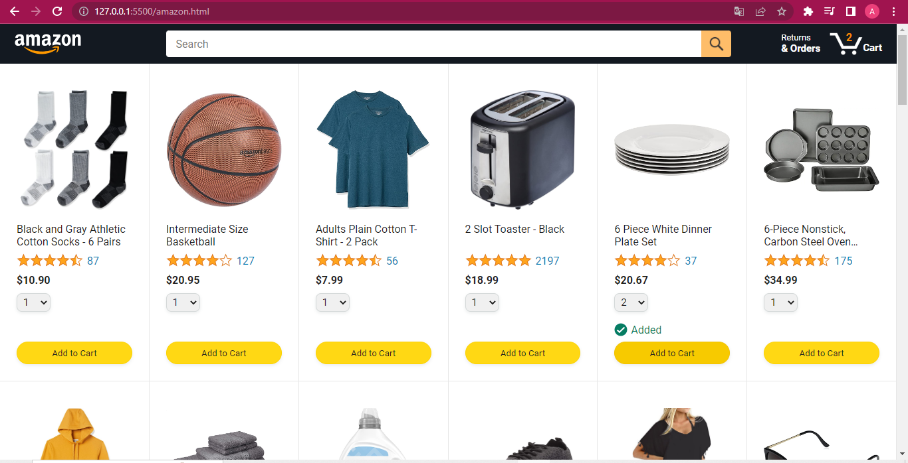

<h1>Amazon projeto para melhorar as minhas habilidades com javascript</h1>

 

Nesse projeto o foco é criar a interatividade das páginas

O que já foi feito:

<ul>
    <li>Adicionar produtos na página usando javascript.</li>
    <li>Deixar o botão do carrinho interativo.</li>
    <li>Adicionar produtos no carrinho através da quantidade selecionada no select.</li>
    <li>Mostrar uma mensagem com set time out, ao adicionar produtos no carrinho.</li>
    <li>Deixar o input interativo.</li>
</ul>

A fazer:

<ul>
    <li>Ao usuário adicionar produtos no carrinho e atualizar a página, o produto deve continuar no carrinho a não ser que o usuário delete o produto na página de pedidos.</li>
    <li>Criar a interatividade da página de pedidos.</li>
    <li>Criar a interatividade da página de checkout.</li>
</ul>

<h3>Status do projeto:</h3>

Em andamento. Conforme estudando e praticando vou melhorando o projeto.

<h3>O que estou aprendendo ao desenvolver esse projeto?</h3>

Esse projeto faz parte de um curso do básico ao intermediário. Adicionar os produtos com javascript foram feitas durante as aulas, as interatividades foram deixadas como exercício.

Com isso eu estou aprendendo a pesquisar de uma maneira melhor, através de documentações do javascript como o MDN e o W3schools, além disso também tive ajuda do chatGPT. Esse projeto também me ajudou a me acostumar a pesquisar e escrever códigos em inglês, com isso qualquer pessoa do mundo vai poder entender o código. Quanto ao javascript, usei array, objetos, Dom em um projeto real.

<!-- # Main idea of javascript

### 1. Save the data.

### 2. Generate the HTML.

### 3. Make it interactive.

## Cart Steps

### 1. Calculate the quantity.

### 2. Put the quantity on the page using the DOM.

## Select steps

### when adding a product to the cart, instead increasing one by one, we'll increase the quantity  by the number in the selector.

## Input interactive steps:

### 1. Get the value that was typed by the user.

### 2. Listen for the event of clicking the search icon button, and listen for the event of clicking the enter key.

### 3. If the words typed by the user match the product(s), display the product in question, otherwise display a message that the product was not found.
-->
